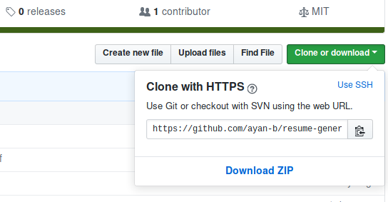

# Resume Generator

> Create a nice latex resume in seconds!

## Instructions

- First clone the repository by running:
  > git clone https://github.com/ayan-b/resume-generator
  or you can also download:  
  
- Then, install all the necessary dependencies from `requirements.txt`:
  > pip install -r requirements.txt
- Check the data file at `config/data.yml`. Change it according to your profile.
- Now run `moban` in your terminal to make your resume![^1]

You can check the rendered pdf files inside `resume/pdf` folder.

## TODO

Support more templates:
- Awesome-CV: https://github.com/posquit0/Awesome-CV
- Deedy-Resume: https://github.com/deedy/Deedy-Resume

## Credits

The resume templates are taken from the following repositories. The original tex
files can be found inside `assets` folder.
- sb2nov-resume: https://github.com/sb2nov/resume, _MIT License_

## Contributing

Want to contribute? Awesome! :tada: You can contribute by:
- Adding more templates (that would be super sweet of you!)
- Submitting bugs that you have encountered
- Submitting pull requests for the existing issues

[^1]: The project uses `moban`. `moban` offers a wide variety of configurations.
Find more at https://moban.readthedocs.io .
